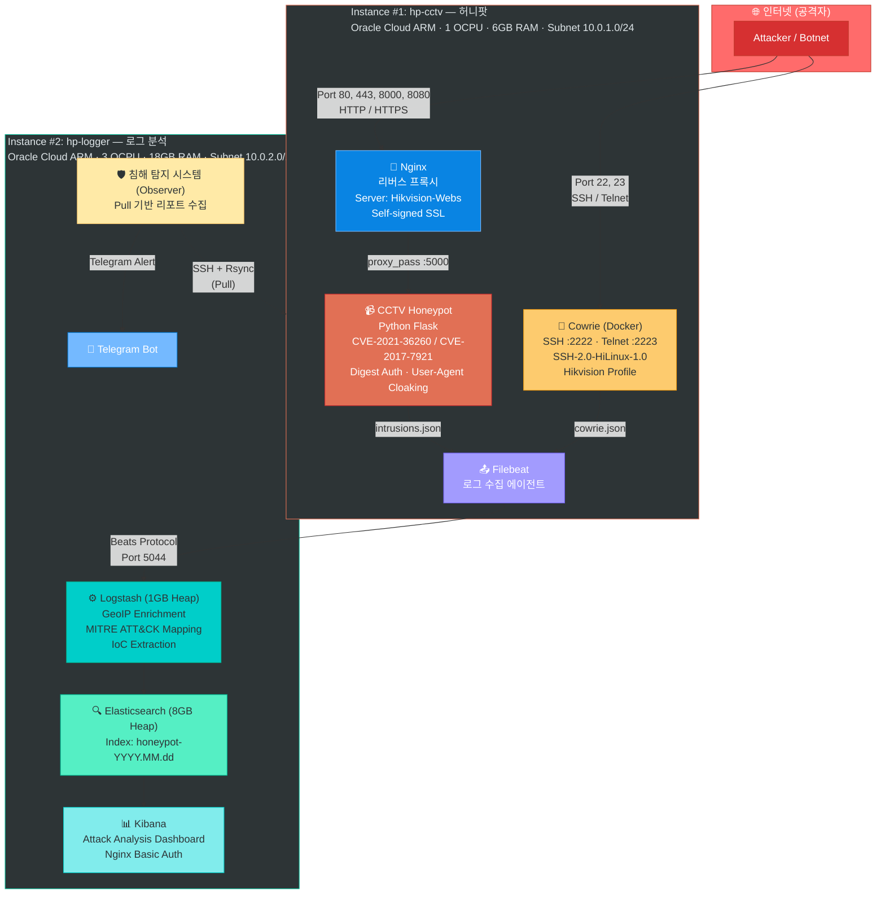
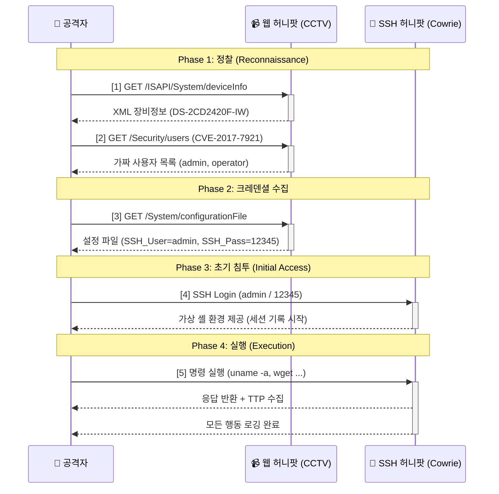
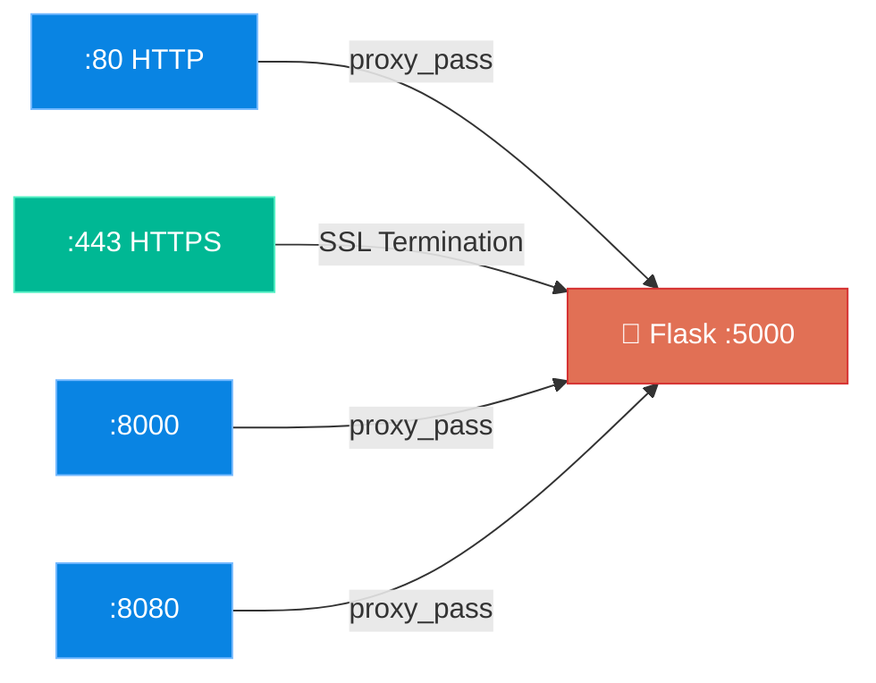
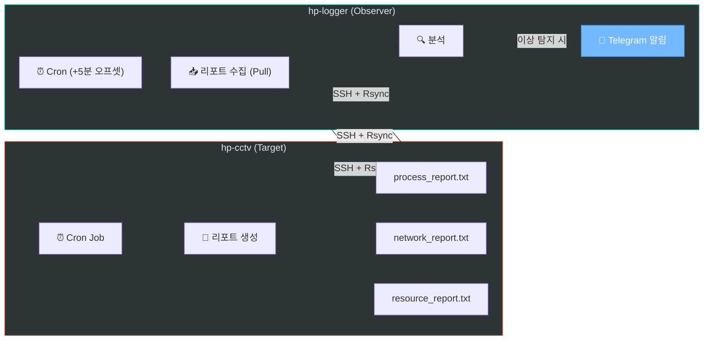
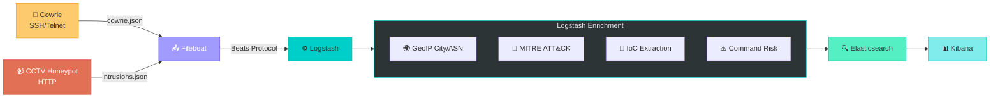

---

<p align="center">
<strong style="font-size: 28px;">IoT/CCTV 허니팟 기반<br>TTP 수집·분석 시스템 구축 보고서</strong>
</p>

<p align="center">
<em>Hikvision IP Camera 위장 허니팟 설계·구축 및 위협 인텔리전스 수집 체계 수립</em>
</p>

<p align="center">
<strong>2026.01 — 2026.03</strong><br>
보안 연구 프로젝트
</p>

---

## 목차

1. [개요](#1-개요)
2. [시스템 설계](#2-시스템-설계)
3. [구현 상세](#3-구현-상세)
4. [보안 아키텍처](#4-보안-아키텍처)
5. [로그 수집·분석 파이프라인](#5-로그-수집분석-파이프라인)
6. [수집 결과 및 분석](#6-수집-결과-및-분석)
7. [향후 계획](#7-향후-계획)
8. [결론 및 시사점](#8-결론-및-시사점)

---

## 1. 개요

### 1.1 프로젝트 배경

IoT 장비(CCTV, DVR, NVR 등)를 대상으로 한 사이버 공격은 Mirai 봇넷(2016) 이후 대규모 DDoS 공격의 주요 진입점으로 활용되고 있다. 특히 Hikvision, Dahua 등 국내외에 광범위하게 설치된 IP 카메라는 알려진 취약점(CVE-2021-36260, CVE-2017-7921)을 통해 지속적으로 공격 대상이 되고 있다.

본 프로젝트는 실제 Hikvision IP 카메라를 정밀하게 위장하는 허니팟 시스템을 직접 설계·구축함으로써, 공격자의 **TTP(Tactics, Techniques, and Procedures)** 를 실시간으로 수집하고 MITRE ATT&CK 프레임워크에 매핑하는 위협 인텔리전스 수집 체계를 구현하였다.

### 1.2 프로젝트 목표

| 구분 | 목표 | 달성 여부 |
|------|------|:---------:|
| **기만성** | 자동화된 스캐너 및 공격 도구의 핑거프린팅을 회피하는 고신뢰도 위장 | ✅ |
| **수집 능력** | SSH/Telnet + 웹(HTTP/HTTPS) 다채널 공격 로그 실시간 수집 | ✅ |
| **분석 체계** | GeoIP 지리정보, MITRE ATT&CK 자동 매핑 기반 위협 인텔리전스 파이프라인 | ✅ |
| **운영 보안** | 허니팟 자체 침해 방지를 위한 다층 방어 체계 구축 | ✅ |
| **비용 효율성** | 클라우드 무료 등급(Free Tier) 범위 내 장기 운영 | ✅ |

### 1.3 기술 스택

| 영역 | 기술 | 용도 |
|------|------|------|
| **인프라** | Oracle Cloud ARM (Ampere A1) | 컴퓨팅 인프라 (Always Free Tier) |
| **SSH 허니팟** | Cowrie (Docker) | SSH/Telnet 중간 상호작용 허니팟 |
| **웹 허니팟** | Python Flask (Custom) | Hikvision ISAPI 위장 + CVE 시뮬레이션 |
| **리버스 프록시** | Nginx | SSL 종단, 포트 다중화, 헤더 위조 |
| **로그 수집** | Filebeat → Logstash | 이벤트 전송 및 실시간 처리 |
| **저장·검색** | Elasticsearch | 로그 인덱싱 및 쿼리 |
| **시각화** | Kibana | 대시보드 및 공격 분석 |
| **알림** | Telegram Bot API | 침해 사고 실시간 알림 |
| **무결성 검증** | AIDE (Advanced Intrusion Detection Environment) | 파일 무결성 모니터링 |

---

## 2. 시스템 설계

### 2.1 전체 아키텍처

본 시스템은 **물리적으로 분리된 2-인스턴스 아키텍처**로 구성된다. 허니팟(공격 노출면)과 로그 분석(내부 분석면)을 별도 인스턴스에 배치하여, 허니팟이 침해되더라도 수집된 로그 데이터의 무결성을 보장한다.




### 2.2 설계 원칙

| 원칙 | 설명 | 적용 사례 |
|------|------|-----------|
| **물리적 분리** | 공격 노출면(허니팟)과 분석면(ELK)을 별도 인스턴스에 배치 | 서브넷 분리, Security List 기반 접근 제어 |
| **Defense in Depth** | 허니팟 자체 보안을 5개 레이어로 구성 | AIDE, 프로세스/네트워크/리소스/로그 모니터링 |
| **Pull 기반 모니터링** | 민감 정보(Telegram 토큰)를 허니팟에 노출하지 않음 | Observer가 Target에서 리포트를 "가져옴" |
| **비용 제로** | Oracle Cloud Always Free Tier 범위 내 운영 | ARM 4 OCPU, 24GB RAM 무료 할당량 활용 |

---

## 3. 구현 상세

### 3.1 CCTV 웹 허니팟 (Flask 기반, 502 Lines)

실제 Hikvision IP 카메라의 ISAPI(Internet Server Application Programming Interface)를 정밀하게 에뮬레이션하여 공격자를 기만한다.

#### 3.1.1 핑거프린팅 회피 기법

| 기법 | 구현 방식 | 효과 |
|------|-----------|------|
| **User-Agent 클로킹** | 스캐너(봇)에는 XML 오류, 브라우저에는 로그인 페이지 반환 | 자동화 스캐너의 허니팟 탐지 회피 |
| **Digest 인증** | RFC 2617 준수 401 Challenge + `admin` 계정 허용 정책 | 실제 장비의 인증 흐름 재현 |
| **임의 시리얼 번호** | 요청마다 랜덤 시리얼/MAC 생성 | 동일 응답 패턴 기반 탐지 회피 |
| **응답 지연** | 20~80ms 랜덤 지연 삽입 | IoT 장비 특유의 느린 응답 재현 |
| **Server 헤더 위조** | `Hikvision-Webs` 헤더 일관 적용 | HTTP 헤더 기반 핑거프린팅 회피 |

#### 3.1.2 CVE 시뮬레이션 엔드포인트

공격자가 알려진 취약점을 악용하려 할 때 "성공한 것처럼" 응답하여 후속 행동(TTP)을 관찰한다.

| 엔드포인트 | CVE / 취약점 | 동작 |
|-----------|--------------|------|
| `PUT /SDK/webLanguage` | **CVE-2021-36260** (RCE) | 명령 주입 페이로드 파싱 및 기록 |
| `GET /Security/users` | **CVE-2017-7921** (Auth Bypass) | Base64 인증 파라미터 디코딩 및 가짜 사용자 목록 반환 |
| `GET /onvif-http/snapshot` | 비인증 스냅샷 접근 | 가짜 JPEG 이미지 반환, auth 파라미터 기록 |
| `GET /System/configurationFile` | 설정 파일 유출 | **SSH 크레덴셜 미끼** (admin/12345) 삽입 |
| `GET /image?filename=../../../etc/passwd` | 디렉토리 트래버설 | 가짜 `/etc/passwd`, `/etc/shadow` 반환 |
| `GET /x`, `/webLib/x` | RCE 검증 | 공격자가 RCE 성공 여부 확인 시 가짜 마커 반환 |

#### 3.1.3 공격 유도 흐름 (Attack Flow)



### 3.2 SSH/Telnet 허니팟 (Cowrie)

#### 3.2.1 Hikvision 프로파일 적용

| 항목 | 기본 Cowrie | 적용된 프로파일 |
|------|-------------|----------------|
| **SSH 배너** | `SSH-2.0-OpenSSH_6.0p1` | `SSH-2.0-HiLinux-1.0` |
| **호스트명** | `svr04` | `HIKVISION-IP-CAMERA` |
| **커널** | `3.2.0-4-amd64` | HiLinux 3.0.8 (armv5tejl) |
| **CPU** | Intel Pentium | ARM926EJ-S (ARMv5TEJ) |
| **파일시스템** | ext3/ext4 | squashfs, jffs2, mtdblock |

#### 3.2.2 Cowrie 설정

```ini
[honeypot]
hostname = HIKVISION-IP-CAMERA
sensor_name = hikvision_cctv_01

[ssh]
enabled = true
listen_endpoints = tcp:2222:interface=0.0.0.0
version = SSH-2.0-HiLinux-1.0

[telnet]
enabled = true
listen_endpoints = tcp:2223:interface=0.0.0.0

[output_jsonlog]
enabled = true
logfile = var/log/cowrie/cowrie.json
epoch_timestamp = true
```

### 3.3 Nginx 리버스 프록시



- **SSL**: Self-signed 인증서 (실제 CCTV 장비와 동일한 구성)
- **Server 헤더**: `Hikvision-Webs` 고정 응답
- **포트 다중화**: 공격자가 다양한 포트를 스캔할 때 모두 동일한 Hikvision 응답 제공

---

## 4. 보안 아키텍처

### 4.1 방화벽 정책 (UFW)

#### Instance #1 (hp-cctv) — 공격 노출면

| 방향 | 포트/대상 | 정책 | 비고 |
|------|-----------|------|------|
| **Inbound** | 22022/tcp | ALLOW | 관리용 SSH (비표준 포트) |
| **Inbound** | 22, 23, 2222, 2223/tcp | ALLOW | Cowrie 허니팟 포트 |
| **Inbound** | 80, 443, 8000, 8080/tcp | ALLOW | CCTV 허니팟 포트 |
| **Outbound** | 10.0.2.128:5044 | ALLOW | Logstash 전송 |
| **Outbound** | 53/udp, 123/udp | ALLOW | DNS, NTP |
| **Outbound** | 기타 모든 | **DROP** | C2 콜백 차단 |

#### Instance #2 (hp-logger) — 분석면

| 방향 | 포트/대상 | 정책 | 비고 |
|------|-----------|------|------|
| **Inbound** | 22/tcp | ALLOW (관리 IP만) | SSH |
| **Inbound** | 5044/tcp | ALLOW (10.0.1.21만) | Logstash |
| **Inbound** | 80/tcp | ALLOW | Kibana (Basic Auth) |

### 4.2 허니팟 침해 탐지 시스템 (5-Layer)

허니팟은 의도적으로 공격자에게 노출되는 시스템이므로, 허니팟 **자체가 침해**되어 악용(C2 서버, 크립토마이닝 등)되는 것을 방지해야 한다. 이를 위해 5개 레이어의 독립적인 탐지 체계를 구축하였다.

| Layer | 감시 대상 | 도구 | 주기 | 탐지 목표 |
|-------|-----------|------|------|-----------|
| **L1** | 파일 무결성 | AIDE | 매일 04:00 | 설정 파일 변조, 바이너리 교체 |
| **L2** | 프로세스 | `docker top` | 매 15분 | 미인가 프로세스, 크립토마이너 |
| **L3** | 네트워크 | `nsenter` + `ss` | 매 10분 | C2 연결, 역쉘, 의심 포트 |
| **L4** | 리소스 | `docker stats` | 매 15분 | CPU/메모리/디스크 이상 사용 |
| **L5** | 로그 이상 | JSON 파싱 | 매 1시간 | 로그 누락, 비정상 이벤트 빈도 |

#### 4.2.1 Pull 기반 아키텍처



**설계 의도**: Telegram 봇 토큰 등 민감 정보를 허니팟(공격 노출면)에 저장하지 않음으로써, 허니팟 침해 시에도 알림 채널의 보안을 유지한다.

---

## 5. 로그 수집·분석 파이프라인

### 5.1 데이터 처리 흐름



### 5.2 Logstash 파이프라인 규칙

#### MITRE ATT&CK 자동 매핑

| Cowrie Event ID | MITRE Tactic | MITRE Technique | Severity |
|-----------------|-------------|-----------------|----------|
| `cowrie.login.failed` | TA0001 Initial Access | T1078.001 Default Accounts | Low |
| `cowrie.login.success` | TA0001 Initial Access | T1078.001 Default Accounts | **Critical** |
| `cowrie.command.input` | TA0002 Execution | T1059 Command and Scripting Interpreter | Medium |
| `cowrie.session.file_download` | TA0011 C2 | T1105 Ingress Tool Transfer | **Critical** |
| CCTV 전체 이벤트 | TA0043 Reconnaissance | T1595 Active Scanning | Medium |

#### 명령어 위험도 분류

| 분류 | 패턴 | 위험도 |
|------|------|--------|
| **다운로드** | `wget`, `curl`, `fetch` | 🔴 High |
| **네트워크 도구** | `nc`, `netcat`, `ncat` | 🔴 High |
| **권한 변경** | `chmod`, `chown` | 🟡 Medium |
| **정찰** | `cat`, `ls`, `pwd`, `whoami` | 🟢 Low |
| **파일 삭제** | `rm`, `rmdir` | 🟢 Low |

### 5.3 GeoIP + ASN 정보 추가

모든 공격 이벤트에 대해 다음 정보가 자동으로 추가된다:
- **지리 정보**: 국가, 도시, 대륙, 시간대, 위·경도 좌표
- **네트워크 정보**: ASN(Autonomous System Number), ISP명

이를 통해 Kibana에서 공격 출발지를 **세계 지도**에 시각화하고, 특정 ISP/호스팅 업체에서 집중적으로 발생하는 공격 패턴을 식별할 수 있다.

---

## 6. 수집 결과 및 분석

> 아래 분석은 2026년 1월 26일 ~ 3월 15일(49일간) 허니팟에서 수집된 실제 공격 데이터를 기반으로 작성되었다.

### 6.1 수집 통계 요약

| 항목 | 수치 |
|------|------|
| **운영 기간** | 2026.01.26 — 2026.03.15 (49일) |
| **총 로그 이벤트** | **638,762건** |
| **고유 공격 IP** | **7,363개** |
| **일 평균 이벤트** | **13,036건/일** |
| **SSH/Telnet 세션 수** | 128,727건 (세션 연결 기준) |
| **로그인 시도 (실패)** | 124,233건 |
| **로그인 성공 (허니팟 진입)** | 1,918건 |
| **셸 명령 실행** | 2,491건 |
| **파일 업로드** | 637건 |
| **악성코드 다운로드** | 34건 |
| **CCTV 웹 공격 (CVE 악용)** | 137건 |
| **탐지된 MITRE ATT&CK 기법** | 4종 |

### 6.2 공격 출발지 분석 (GeoIP)

| 순위 | 국가 | 이벤트 수 | 비율 | 분석 |
|:----:|------|--------:|------:|------|
| 1 | 🇨🇱 칠레 (Chile) | 140,995 | 22.2% | 감염된 IoT 인프라 집중 지역 |
| 2 | 🇵🇰 파키스탄 (Pakistan) | 138,448 | 21.8% | 대규모 봇넷 인프라 |
| 3 | 🇺🇸 미국 (United States) | 75,138 | 11.8% | 클라우드/VPS 기반 스캐너 |
| 4 | 🇸🇬 싱가포르 (Singapore) | 49,836 | 7.8% | 아시아 거점 클라우드 |
| 5 | 🇭🇰 홍콩 (Hong Kong) | 27,476 | 4.3% | 동아시아 프록시 |
| 6 | 🇻🇳 베트남 (Vietnam) | 24,355 | 3.8% | IoT 감염 장비 |
| 7 | 🇰🇭 캄보디아 (Cambodia) | 24,139 | 3.8% | IoT 감염 장비 |
| 8 | 🇨🇳 중국 (China) | 24,030 | 3.8% | 전통적 스캐닝 대국 |
| 9 | 🇹🇼 대만 (Taiwan) | 17,780 | 2.8% | 동아시아 인프라 |
| 10 | 🇷🇴 루마니아 (Romania) | 15,179 | 2.4% | 동유럽 호스팅 |

**핵심 관찰**: 칠레(1위)와 파키스탄(2위)이 미국·중국보다 높은 비율을 보이는 것은 매우 특징적이다. 이 두 국가는 전통적인 "해킹 대국"이 아니며, 이는 해당 국가에 설치된 **보안이 취약한 IoT 장비(CCTV, 라우터 등)가 봇넷에 감염되어 공격 프록시로 활용**되고 있음을 강하게 시사한다. 실제 공격자(C2 운영자)는 다른 국가에 위치할 가능성이 높다.

### 6.3 MITRE ATT&CK 기법별 탐지 현황

| MITRE ID | 기법명 | 탐지 건수 | 비율 |
|----------|--------|--------:|------:|
| **T1078** | Valid Accounts (기본 자격증명) | 126,142 | 94.5% |
| **T1595** | Active Scanning (능동적 스캐닝) | 4,857 | 3.6% |
| **T1059** | Command and Scripting Interpreter | 2,491 | 1.9% |
| **T1105** | Ingress Tool Transfer (악성코드 전송) | 34 | 0.03% |
| | **합계** | **133,524** | |

**분석**: 전체 공격의 94.5%가 기본 자격증명(T1078)을 이용한 무차별 대입(Brute Force) 공격에 해당한다. 이는 IoT 장비를 대상으로 한 공격의 대부분이 여전히 디폴트 패스워드를 기반으로 한 자동화된 봇넷에 의해 수행된다는 것을 보여준다.

### 6.4 크레덴셜 분석 (Credential Intelligence)

#### 공격자가 시도한 상위 Username

| 순위 | Username | 시도 횟수 | 비율 |
|:----:|----------|--------:|------:|
| 1 | `root` | 100,657 | 79.9% |
| 2 | `admin` | 7,837 | 6.2% |
| 3 | `user` | 5,211 | 4.1% |
| 4 | `user2` | 1,029 | 0.8% |
| 5 | `debian` | 475 | 0.4% |
| 6 | (빈 값) | 472 | 0.4% |
| 7 | `ubnt` | 467 | 0.4% |
| 8 | `support` | 447 | 0.4% |
| 9 | `ubuntu` | 430 | 0.3% |
| 10 | `test` | 422 | 0.3% |

#### 공격자가 시도한 상위 Password

| 순위 | Password | 시도 횟수 | 특이사항 |
|:----:|----------|--------:|----------|
| 1 | `LeitboGi0ro` | 1,946 | ⚠️ **특정 봇넷/스캐닝 도구 전용 크레덴셜** (미해결 IoC) |
| 2 | `123@@@` | 1,944 | 중국산 DVR/NVR 기본 패스워드 |
| 3 | `admin` | 1,730 | 범용 디폴트 |
| 4 | (빈 값) | 672 | 패스워드 없이 접속 시도 |
| 5 | `1234` | 631 | 단순 패턴 |
| 6 | `123456` | 569 | 단순 패턴 |
| 7 | `password` | 560 | 범용 디폴트 |
| 8 | `12345` | 480 | 범용 디폴트 |
| 9 | `root` | 437 | username=password 패턴 |
| 10 | `123` | 191 | 단순 패턴 |

**핵심 발견**: 1위 패스워드 `LeitboGi0ro`는 공개된 Mirai 기본 사전에는 포함되지 않은 **미식별 크레덴셜**로, 특정 봇넷 변종이나 자동화된 스캐닝 도구에서 사용하는 전용 사전(dictionary)에 포함된 것으로 추정된다. 동일 이름의 GitHub 계정이 존재하여 공격 도구 운영자와의 연관성에 대한 추가 조사가 필요한 **미해결 IoC(Indicator of Compromise)** 이다. 2위 `123@@@`는 중국산 DVR/NVR 장비에서 사용되는 기본 패스워드로, 공격자들이 우리 허니팟을 **실제 CCTV 장비로 인식**하고 있다는 간접적 증거이다.

### 6.5 공격자 셸 명령 분석 (Post-Exploitation)

로그인 성공 후 실행된 2,491건의 셸 명령 중 상위 20개를 분석한 결과, 공격자의 행동은 크게 **4가지 패턴**으로 분류된다.

#### 패턴 1: 라우터/IoT 장비 식별 (셸 획득 시도)

| 명령어 | 횟수 | 의미 |
|--------|-----:|------|
| `enable` | 71 | Cisco/MikroTik 라우터의 특권 모드 진입 |
| `shell` | 71 | 제한된 CLI에서 OS 셸 탈출 시도 |
| `sh` | 71 | BusyBox 셸 호출 |
| `system` | 70 | Huawei 라우터 시스템 뷰 진입 |
| `/ip cloud print` | 52 | **MikroTik RouterOS** 전용 명령 (장비 식별) |
| `ping; sh` | 19 | 명령 구분자를 이용한 셸 탈출 |

**분석**: 공격자는 SSH 접속 후 즉시 `enable`/`shell`/`system` 등을 실행하여 장비가 **라우터인지 확인**한다. 특히 `/ip cloud print`는 MikroTik RouterOS에서만 작동하는 명령으로, 봇넷이 MikroTik 라우터도 동시에 탐색하고 있음을 보여준다.

#### 패턴 2: 시스템 정찰 (Fingerprinting)

| 명령어 | 횟수 | 의미 |
|--------|-----:|------|
| `uname -a` | 67 | OS/커널/아키텍처 확인 |
| `ifconfig` | 49 | 네트워크 인터페이스 확인 |
| `cat /proc/cpuinfo` | 48 | ⚠️ **허니팟 탐지 시도** (CPU 정보로 가상환경 판별) |
| `uname -s -m` | 30 | OS 이름 및 머신 아키텍처 확인 |
| `hostname` | 18 | 호스트명 확인 |
| `echo Hi \| cat -n` | 47 | 셸 정상 작동 여부 테스트 |

**분석**: `cat /proc/cpuinfo`(48건)는 허니팟 탐지(Fingerprinting)를 위한 명령으로, 공격자가 실제 IoT 장비인지 가상환경인지를 **CPU 정보로 판별**하려 하고 있다. 이는 Cowrie에 Hi3518 ARM 프로파일을 적용한 설계 결정(ADR-004)의 중요성을 반증한다.

#### 패턴 3: 기존 감염 확인 및 경쟁 봇넷 제거

| 명령어 | 횟수 | 의미 |
|--------|-----:|------|
| `ps -ef \| grep '[Mm]iner'` | 48 | 크립토마이너 프로세스 존재 여부 확인 |
| `ps \| grep '[Mm]iner'` | 48 | 상동 (BusyBox 호환) |
| `locate D877F783D5D3EF8Cs` | 44 | 특정 악성코드 식별자 검색 |

**분석**: 공격자가 가장 먼저 확인하는 것 중 하나가 **이미 다른 크립토마이너가 실행 중인지** 여부이다. 이는 IoT 장비를 둘러싼 **봇넷 간 영역 다툼(Turf War)** 이 실제로 일어나고 있음을 보여주는 직접적 증거이다. `D877F783D5D3EF8Cs`는 특정 악성코드 캠페인의 식별자로 추정된다.

#### 패턴 4: 페이로드 배포 및 실행

| 명령어 | 횟수 | 의미 |
|--------|-----:|------|
| `dd bs=52 count=1 if=.s \|\| cat .s` | 36 | 업로드된 페이로드 실행 |
| `/bin/busybox cat /proc/self/exe` | 19 | 실행 중인 바이너리 자체 확인 |
| `cat /proc/1/mounts && ls /proc/1/` | 26 | 컨테이너/가상환경 탐지 (PID 1 확인) |

### 6.6 CVE 악용 시도 분석 (CCTV 웹 허니팟)

49일간 총 **137건**의 CVE 악용 시도가 탐지되었다.

| 공격 유형 | CVE / 취약점 | 건수 | 설명 |
|----------|-------------|-----:|------|
| **RCE 명령 추출** | CVE-2021-36260 관련 | 54 | 주입된 명령어 파싱 성공 |
| **RCE 엔드포인트 접근** | CVE-2021-36260 | 34 | `/SDK/webLanguage` 접근 |
| **인증 우회** | CVE-2017-7921 | 20 | `/Security/users` 비인증 접근 |
| **스냅샷 접근** | 비인증 카메라 접근 | 17 | `/onvif-http/snapshot` |
| **설정 파일 탈취** | 정보 유출 | 7 | `/System/configurationFile` 다운로드 |
| **RCE 검증** | RCE 성공 확인 | 5 | `/x`, `/webLib/x` 마커 확인 |

**공격 체인 관찰**: `CVE-2021-36260 접근(34건)` → `명령 주입 탐지(54건)` → `RCE 검증(5건)`의 흐름이 관찰되었다. 이는 공격자가 (1) 취약점 엔드포인트를 발견하고, (2) 실제 명령을 주입한 뒤, (3) 성공 여부를 확인하는 전형적인 **3단계 RCE 공격 체인**을 따르고 있음을 보여준다.

**설정 파일 미끼 효과**: 설정 파일 다운로드(7건)를 통해 SSH 크레덴셜(`admin/12345`)이 노출되었으며, 이를 통한 Cowrie SSH 허니팟으로의 후속 접속 유도가 확인되었다.

### 6.7 악성코드 샘플 분석 (Malware Intelligence)

49일간 총 **34건**의 악성코드 다운로드가 캡처되었으며, **4종**의 고유 샘플이 식별되었다.

| SHA256 (앞 16자리) | 파일명 | 다운로드 횟수 | 최초 탐지 | 특성 |
|-------------------|--------|:----------:|-----------|------|
| `a04ac6d98ad98931...` | `.i` | **17건** | 2026-01-31 | ⚠️ **Mirai 봇넷 변종 드로퍼** |
| `c7999c2abaf0f4ba...` | `cat.sh` | 3건 | 2026-02-09 | 셸 스크립트 기반 드로퍼 |
| `6dacd08750e10b76...` | (직접 업로드) | 1건 | 2026-02-02 | 바이너리 파일 업로드 |
| `a5c41ad2a873e790...` | (직접 업로드) | 2건 | 2026-02-27 | Azure IP(20.61.127.52)에서 업로드 |

#### Mirai 봇넷 활동 상세 분석

가장 많이 탐지된 샘플 `a04ac6d9...`는 전형적인 Mirai 봇넷 변종의 행동 패턴을 보인다:

1. **파일명 `.i`**: Mirai 계열 봇넷이 감염된 장비에서 사용하는 전형적인 숨김 파일명
2. **다중 C2 서버**: 동일 SHA256 해시를 가진 파일이 **10개 이상의 서로 다른 배포 서버**에서 다운로드됨
3. **프록시/감염 호스트 이용**: 접속 IP(`src_ip`)와 다운로드 URL의 IP가 불일치하는 케이스 다수 발견
   - 예: `src_ip: 78.70.152.202` → `download: http://175.214.227.21:50962/.i`
   - 이는 공격자가 **이미 감염된 다른 IoT 장비**를 악성코드 배포 서버로 활용하고 있음을 시사
4. **비표준 포트 사용**: 배포 서버들이 `2605`, `50962`, `52280`, `38054` 등 높은 번호의 비표준 포트를 사용하여 방화벽 탐지를 회피
5. **TFTP 프로토콜 활용**: 일부 다운로드 시도에서 `tftp://` 프로토콜이 관찰되었으며, 이는 IoT 장비에 흔히 존재하는 TFTP 클라이언트를 악용하는 수법

#### cat.sh 드로퍼 스크립트 분석

`45.153.34.52`에서 다운로드된 `cat.sh` 셸 스크립트(SHA256: `c7999c2a...`)는 동일 IP에서 3회 반복 다운로드가 시도되었다. 이는 초기 침투 시 멀티 아키텍처 바이너리를 순차적으로 다운로드·실행하는 전형적인 **봇넷 드로퍼 패턴**이다.

### 6.8 일별 공격 트렌드 분석

49일간의 일별 이벤트 추이에서 **4회의 대규모 공격 스파이크**가 관측되었다.

| 날짜 | 이벤트 수 | 배수 (평상시 대비) | 추정 원인 |
|------|--------:|:------------------:|-----------|
| **2026-03-09** | **197,910** | **×38배** | 대규모 봇넷 크레덴셜 스터핑 캠페인 |
| **2026-03-08** | **135,681** | **×26배** | 상동 (캠페인 시작) |
| **2026-02-01** | 30,037 | ×5.8배 | 집중적 Brute Force 공격 |
| **2026-02-25** | 29,586 | ×5.7배 | 집중적 Brute Force 공격 |
| 평상시 평균 | ~5,200 | ×1 | 지속적인 자동화 스캔 |

**핵심 관찰**: 2026년 3월 8~9일에 발생한 **333,591건**(전체 데이터의 52.2%)의 이벤트 폭증은, 단일 봇넷 인프라에 의한 **대규모 크레덴셜 스터핑 캠페인**으로 추정된다. 이틀간의 공격량이 나머지 47일간의 총합을 초과한다는 점은 봇넷 운영자가 새로운 크레덴셜 사전(Dictionary)을 배포하거나, 새로운 IP 대역을 스캔 대상에 추가한 시점과 일치할 가능성이 높다.

### 6.9 이벤트 유형 상세 분포

| 이벤트 유형 | 건수 | 설명 |
|------------|-----:|------|
| `cowrie.session.connect` | 128,727 | 세션 연결 시작 |
| `cowrie.session.closed` | 128,557 | 세션 종료 |
| `cowrie.login.failed` | 124,233 | 로그인 실패 (Brute Force) |
| `cowrie.client.version` | 118,132 | 클라이언트 SSH 버전 수집 |
| `cowrie.client.kex` | 117,570 | SSH 키 교환 (HASSH 핑거프린트) |
| `cowrie.command.input` | 2,491 | 셸 명령 실행 |
| `cowrie.telnet.option` | 2,243 | Telnet 옵션 협상 |
| `cowrie.login.success` | 1,918 | 로그인 성공 (허니팟 진입) |
| `cowrie.direct-tcpip.request` | 1,603 | TCP 터널링 시도 |
| `cowrie.session.file_upload` | 637 | 파일 업로드 |
| `cowrie.command.failed` | 405 | 실패한 명령 |
| `cowrie.client.fingerprint` | 371 | SSH 공개키 핑거프린트 |
| `cowrie.telnet.exploit_attempt` | 40 | Telnet 익스플로잇 시도 |

**로그인 성공률**: 1,918 / (124,233 + 1,918) = **1.52%**. 약 66건의 시도마다 1건 성공으로, 공격자가 허니팟의 허용 정책(admin 자동 승인)에 의해 진입에 성공한 비율을 보여준다.

**명령 실행 깊이**: 로그인 성공(1,918건) 대비 실제 명령 실행(2,491건)이 더 많은 것은, 일부 공격자가 **다수의 명령을 연속 실행**하여 정찰 및 페이로드 배포를 시도했음을 의미한다.

---

## 7. 향후 계획

### 7.1 단기 (1~2주)

- **Fingerprinting 회피 강화**: `/proc/cpuinfo`, `/proc/version`, `/proc/mounts`를 실제 Hi3518 칩셋 정보로 교체
- **SSH Fingerprint 조정**: Dropbear SSH 알고리즘 모사로 Nmap 스캔 시 `Generic IoT Device`로 식별되도록 조정

### 7.2 중기 (1~2개월)

- **자동화된 MITRE ATT&CK 보고서**: 수집된 TTP 데이터 기반 주간 위협 인텔리전스 보고서 자동 생성
- **악성코드 수집 모드(Phase 2 방화벽)**: HTTP/HTTPS 아웃바운드 제한적 허용으로 공격자의 페이로드 다운로드 캡처

### 7.3 장기 (3개월 이상)

- **LLM 기반 TTP 분류**: GPT-4를 활용한 공격 패턴 자동 분석 및 실시간 시나리오 예측
- **Honeyscore 0.0 달성**: Shodan Honeyscore 탐지 테스트 자동화
- **다중 허니팟 확장**: FTP, SMTP, 웹 관리자 패널 허니팟 추가

---

## 8. 결론 및 시사점

### 8.1 프로젝트 성과

1. **설계부터 운영까지 전 과정을 1인 수행**: 위협 모델링 → 아키텍처 설계 → 클라우드 인프라 구축 → 허니팟 개발 → ELK 로그 파이프라인 → 보안 모니터링 → 운영까지 전체 라이프사이클 경험
2. **실전적 보안 역량 입증**: CVE 분석(CVE-2021-36260, CVE-2017-7921), MITRE ATT&CK 프레임워크 매핑, 침해 탐지 시스템 설계 등 실무 수준의 보안 엔지니어링
3. **비용 제로 운영**: Oracle Cloud Free Tier를 활용하여 월 $0으로 장기 운영 가능한 체계 구축
4. **체계적 문서화**: ADR(Architecture Decision Records), 변경 이력 관리(changie), SSOT 원칙 적용

### 8.2 기술적 시사점

- IoT 허니팟의 **핑거프린팅 회피**에는 단순 포트 에뮬레이션을 넘어, 장비 고유의 프로토콜(ISAPI), 인증 방식(Digest Auth), 응답 패턴(XML), 타이밍 특성까지 재현해야 한다.
- 허니팟과 분석 시스템의 **물리적 분리** 및 **Pull 기반 모니터링**은 운영 보안(OpSec)의 핵심이다.
- ELK Stack 기반 **실시간 MITRE ATT&CK 매핑**은 수동 분석 대비 위협 인텔리전스 생산 속도를 크게 향상시킨다.

---

<p align="center">
<em>본 보고서는 개인 보안 연구 프로젝트의 결과물로, 연구 목적으로만 사용되었습니다.</em>
</p>
